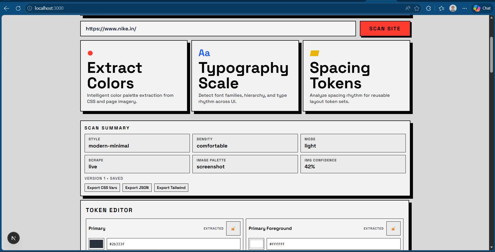
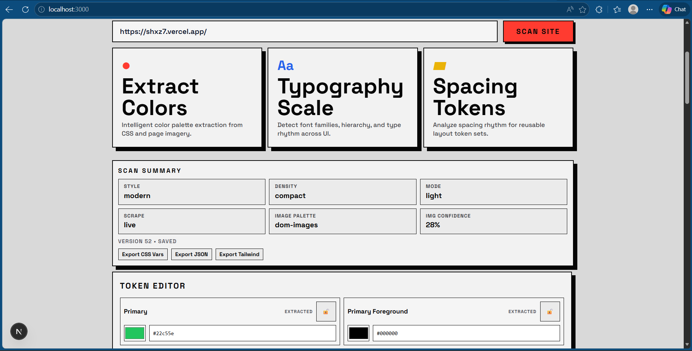
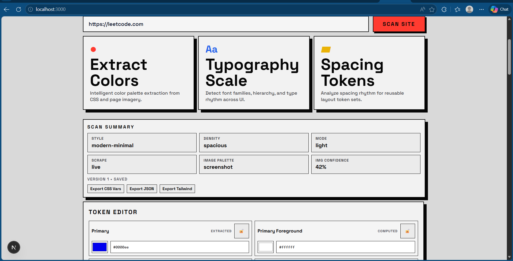

# StyleSync – Design System Extractor

## 🚀 Live Demo
https://style-sync2.vercel.app

## 💻 Source Code
- GitHub Repository (Public): https://github.com/SHXZ7/StyleSync
- Main Frontend: frontend/
- Main Backend: backend/

## 📌 Overview
StyleSync is a web-based tool that converts any website into a live design system.

Features:
- Extract colors, typography, spacing
- Generate semantic design tokens
- Component system (buttons, inputs, cards)
- Live preview system
V
---

## ⚙️ Tech Stack
Frontend: Next.js  
Backend: FastAPI  
Database: MongoDB  

---

## 🔧 Setup Instructions

### Backend
cd backend  
pip install -r requirements.txt  
uvicorn main:app --reload  

Environment setup:  
- Copy backend/.env.example to backend/.env  
- Fill MongoDB values if using Atlas persistence  

### Frontend
cd frontend  
npm install  
npm run dev  

Environment setup:  
- Copy frontend/.env.local.example to frontend/.env.local  
- Set NEXT_PUBLIC_API_BASE_URL to backend URL if not local  

---

## 🌐 Deployment
Frontend: Vercel  
Backend: Render / Railway  

---

## 🎥 Demo Video
[Add video link]

---

## 🗄️ Database Schema / Migrations
- MongoDB schema file: backend/data/theme_state.schema.json
- State storage implementation: backend/services/theme_state.py
- Migration scripts: Not required currently (MongoDB document model with schema file reference)

---

## 📸 Screenshots
1. Nike output: https://www.nike.in/

2. Vercel app output: https://shxz7.vercel.app/

3. LeetCode output: https://leetcode.com

---

## 🧠 Features Implemented
- Web scraping engine
- Token extraction (color, typography, spacing)
- Component detection
- Token normalization system
